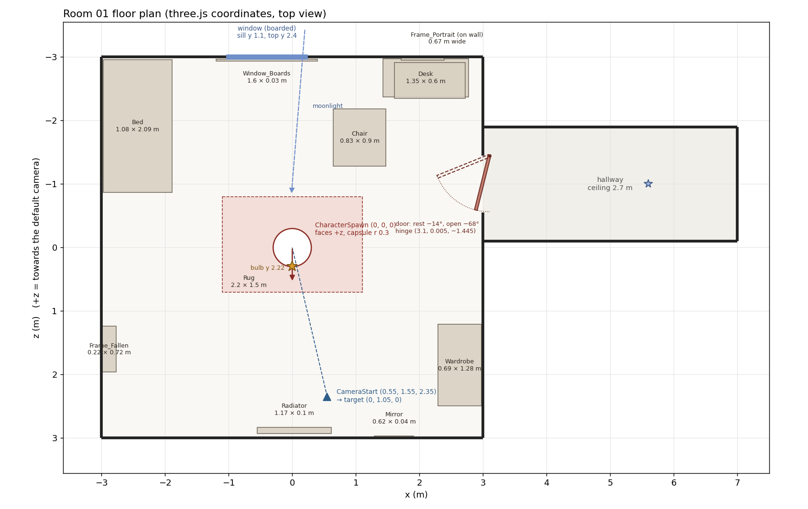

# Room 01: build measurements

Every measurement used to build the Room 01 preview, in three.js coordinates, so the scene can be rebuilt or matched exactly in React Three Fiber.

Two sources were cross-checked to make this file: the Blender build script's own record of every part it made, and the scene exactly as three.js r186 loads it from `horror_room.glb`. Rebuilding each model's bounds from the part list alone matches three.js to within 2.5 mm.

## How to use this (read first)

1. **To match the preview exactly, load `models/horror_room.glb`.** It already contains every model below, with textures, lights and the door animation. Do not rebuild the room from primitives unless you need to; the part tables are here so you know exactly what is where.
2. Find things by name: `gltf.scene.getObjectByName("Bed")`. Names in the tables are the exact three.js object names.
3. Put the player or character on `CharacterSpawn`. Start the camera at `CameraStart` looking at `CameraTarget`.
4. Copy the render settings in section 8 exactly. Most of the look comes from those (exposure, fog, shadows, flicker).
5. `room01.layout.json` has all of this as data, including every part with world and model-local coordinates. `floorplan.png` is the top view.
6. Compare your result with `reference_camera_start.jpg` (rendered by the preview from the start camera, flicker off).

## 1. Conventions

| | |
|---|---|
| Units | metres |
| Up | +Y. The floor is y = 0 |
| Forward | the character faces +Z, towards the default camera |
| Room | x and z both run from −3 to +3; ceiling at y = 3 |
| Back / front | back wall (window) is z = −3; front wall is z = +3, behind the camera |
| Left / right | left wall (bed) is x = −3; right wall (door) is x = +3 |
| Rotations | degrees below, Euler order XYZ (three.js default). Radians and quaternions are in the JSON |
| Model origin | each prop's origin is the bottom-centre of its bounding box, so `position` is where it stands. Structure pieces have their origin at (0, 0, 0) |

## 2. Room shell

| Element | Measurement |
|---|---|
| Floor | 6 × 6 m, x ∈ [−3, 3], z ∈ [−3, 3], y = 0 |
| Ceiling height | 3 m |
| Wainscot (wood panelling) | floor to y = 1; wallpaper above |
| Baseboard | 0.14 m tall, 0.025 m deep |
| Chair rail | 0.05 m tall, 0.035 m deep, centred on y = 1.0 |
| Crown moulding | 0.1 m tall, 0.08 m deep, at the ceiling |
| Window opening | back wall, x ∈ [-1, 0.2] (1.2 m wide), y ∈ [1.1, 2.4] (1.3 m tall), reveal 0.18 m deep |
| Window glass | z = -3.14 (dark, reflective) |
| Night sky plane | z = -4.2, 6 × 4 m, emissive blue |
| Door opening | right wall, z ∈ [-1.45, -0.55] (0.9 m wide), y ∈ [0, 2.1], reveal 0.18 m deep |
| Door slab | 0.88 wide × 2.08 tall × 0.045 thick; hinge at (3.1, 0.005, -1.445) |
| Door angle | closed 0°, file default (ajar) −14°, open −68° (rotation about +Y; negative swings into the room) |
| Hallway | x ∈ [3, 7], z ∈ [-1.9, -0.1], ceiling 2.7 m, end wall black |
| Bulb | glass centre (0, 2.22, 0.3); light at (0, 2.16, 0.3) |

## 3. Markers (starting positions)

| Node | Position | Use |
|---|---|---|
| `CharacterSpawn` | (0, 0, 0) | Character / player start. Feet on y = 0, facing +Z. Centre of the rug. The bulb hangs 0.3 m in front of it (towards the camera), 2.22 m up |
| `CameraStart` | (0.55, 1.55, 2.35) | Default camera position |
| `CameraTarget` | (0, 1.05, 0) | Camera look-at point (the character's chest) |

Placeholder character: 1.764 m tall, bounds (-0.314, 0.017, -0.124) to (0.313, 1.781, 0.153), clip `Idle_Sway` (4 s loop, ±2° sway).
Character fit rule used by the preview: scale 1 unless height < 1.2 or > 2.6 m, then scale to 1.75 m; then offset so the bounding box is centred on x/z and its bottom sits on y = 0.

## 4. Models: position and size

Position is the three.js `position` of the object (its origin). Size is width (x) × height (y) × depth (z) of its world bounding box.

| Model | What it is | Position (x, y, z) | Rotation° | Size W × H × D | Bounds min → max | Tris |
|---|---|---|---|---|---|---|
| `Floor` | Floor plane, worn wooden planks. y = 0. | (0, 0, 0) | (0, 0, 0) | 6 × 0 × 6 | (-3, 0, -3) → (3, 0, 3) | 2 |
| `Ceiling` | Ceiling plane, stained cracked plaster. y = 3. | (0, 0, 0) | (0, 0, 0) | 6 × 0 × 6 | (-3, 3, -3) → (3, 3, 3) | 2 |
| `Wall_Back` | Back wall (z = −3) with the window opening cut out. Wainscot below y = 1, wallpaper above. | (0, 0, 0) | (0, 0, 0) | 6 × 3 × 0 | (-3, 0, -3) → (3, 3, -3) | 14 |
| `Wall_Front` | Front wall (z = +3), behind the default camera. | (0, 0, 0) | (0, 0, 0) | 6 × 3 × 0 | (-3, 0, 3) → (3, 3, 3) | 4 |
| `Wall_Left` | Left wall (x = −3). | (0, 0, 0) | (0, 0, 0) | 0 × 3 × 6 | (-3, 0, -3) → (-3, 3, 3) | 4 |
| `Wall_Right` | Right wall (x = +3) with the door opening cut out. | (0, 0, 0) | (0, 0, 0) | 0 × 3 × 6 | (3, 0, -3) → (3, 3, 3) | 10 |
| `Trim` | Baseboards, chair rail at y = 1 and crown moulding, all four walls. | (0, 0, 0) | (0, 0, 0) | 6 × 3 × 6 | (-3, 0, -3) → (3, 3, 3) | 1,512 |
| `Window` | Window reveal, sill, frame, sash bars, dark glass, and the emissive night-sky plane 1.2 m behind the wall. | (-0.4, 0, -3.555) | (0, 0, 0) | 6 × 4 × 1.29 | (-3.4, 0, -4.2) → (2.6, 4, -2.91) | 496 |
| `Window_Boards` | Four planks nailed across the window at angles. The moonlight shines through the gaps. | (-0.4, 1.102, -2.951) | (0, 0, 0) | 1.6 × 1.213 × 0.034 | (-1.2, 1.102, -2.967) → (0.4, 2.315, -2.934) | 656 |
| `Door_Frame` | Door reveal (0.18 m deep) and painted casing. | (3.075, 0, -1) | (0, 0, 0) | 0.21 × 2.21 × 1.18 | (2.97, 0, -1.59) → (3.18, 2.21, -0.41) | 360 |
| `Door_Hinge` → `Door` | Panelled door slab with brass knobs. Child of Door_Hinge; parts are in hinge-local space. | (3.1, 0.005, -1.445) | (0, -14, 0) | 0.312 × 2.08 × 0.863 | (2.808, 0.005, -1.45) → (3.121, 2.085, -0.587) | 1,292 |
| `Hallway` | Dark corridor beyond the door: floor, ceiling, side walls, black end wall. | (0, 0, 0) | (0, 0, 0) | 4 × 2.7 × 1.8 | (3, 0, -1.9) → (7, 2.7, -0.1) | 18 |
| `Bed` | Rusted iron bed against the left wall, head at the back. Stained mattress, pillow, sheet draped over the right side. | (-2.433, 0, -1.91) | (0, 0, 0) | 1.085 × 1.205 × 2.09 | (-2.975, 0, -2.955) → (-1.89, 1.205, -0.865) | 3,296 |
| `Wardrobe` | Painted wardrobe on the right wall near the front, leaning 1.6° away from the wall. | (2.635, -0.017, 1.85) | (0, 0, 0) | 0.686 × 2.145 × 1.28 | (2.292, -0.017, 1.21) → (2.978, 2.127, 2.49) | 740 |
| `Desk` | Dark wooden desk in the back-right corner with a drawer. | (2.1, 0, -2.67) | (0, 0, 0) | 1.35 × 0.78 × 0.6 | (1.425, 0, -2.97) → (2.775, 0.78, -2.37) | 784 |
| `Desk_Items` | Candle in a brass holder, stack of three books, old radio, loose sheets of paper. | (2.163, 0.78, -2.632) | (0, 0, 0) | 1.114 × 0.22 × 0.566 | (1.606, 0.78, -2.916) → (2.72, 1, -2.349) | 664 |
| `Chair` | Wooden chair knocked over on its back between the desk and the centre. | (1.06, 0, -1.732) | (0, 0, 0) | 0.827 × 0.481 × 0.9 | (0.646, 0, -2.182) → (1.473, 0.481, -1.282) | 1,080 |
| `Rug` | Worn red rug under the character, 2.2 × 1.5 m. | (0, 0, -0.05) | (0, 0, 0) | 2.2 × 0.012 × 1.5 | (-1.1, 0, -0.8) → (1.1, 0.012, 0.7) | 12 |
| `Hanging_Bulb` | Ceiling rose, cord and a bare bulb over the character. Emissive glass M_BulbGlass. | (0, 2.17, 0.3) | (0, 0, 0) | 0.18 × 0.83 × 0.18 | (-0.09, 2.17, 0.21) → (0.09, 3, 0.39) | 444 |
| `Frame_Portrait` | Brass-framed portrait with the face scratched out, back wall, tilted 6°. | (2.05, 1.452, -2.97) | (0, 0, 0) | 0.672 × 0.797 × 0.04 | (1.714, 1.452, -2.99) → (2.386, 2.248, -2.95) | 434 |
| `Frame_Fallen` | Mirror frame that has fallen and leans against the left wall. | (-2.88, 0, 1.6) | (0, 0, 0) | 0.223 × 0.762 × 0.72 | (-2.991, 0, 1.24) → (-2.769, 0.762, 1.96) | 434 |
| `Radiator` | Cast-iron radiator on the front wall. | (0.034, 0, 2.88) | (0, 0, 0) | 1.168 × 0.78 × 0.1 | (-0.55, 0, 2.83) → (0.618, 0.78, 2.93) | 1,644 |
| `Mirror` | Wall mirror on the front wall (behind the camera). | (1.6, 1.15, 2.982) | (0, 0, 0) | 0.62 × 0.9 × 0.035 | (1.29, 1.15, 2.965) → (1.91, 2.05, 3) | 110 |
| `Debris` | Loose pages, broken board pieces and plaster chunks on the floor. Kept clear of the character area. | (0, 0, 0) | (0, 0, 0) | 4.837 × 0.036 × 5.085 | (-2.613, -0.002, -2.722) → (2.225, 0.034, 2.363) | 1,476 |

Totals: 60 meshes (three.js splits multi-material models into child meshes named `Bed_1`, `Bed_2`, …), 15,488 triangles in the room, 4,140 in the placeholder character.

## 5. Models: every part

These are the exact primitives the build script used. Positions are **world** coordinates (three.js), except `Door`, whose parts are relative to `Door_Hinge`. Model-local coordinates (world minus the model's position) are in the JSON as `localPosition`.

How to read the shapes:

- **box**: `BoxGeometry(w, h, d)` at the position, rotated by the Euler angles. `bevel` = rounded edges of that radius (cosmetic).
- **cyl**: `CylinderGeometry(radiusTop, radiusBottom, height)`, axis along its local +Y before rotation.
- **tube**: a cylinder of the given radius running from one point to another (bed rails, pipes).
- **sphere**: `SphereGeometry(radius)` scaled by (sx, sy, sz).
- **panel**: a flat four-corner face (walls, glass, pictures); the span shows its extent and which way it faces.
- **cloth**: a draped grid surface (bed sheet, curled pages); bounds shown.

### Floor

Floor plane, worn wooden planks. y = 0. Position (0, 0, 0), size 6 × 0 × 6 m, 1 parts.

| # | Shape | Dimensions (m) | Position (x, y, z) | Rotation° | Material |
|---|---|---|---|---|---|
| 1 | panel | x -3…3, y 0, z -3…3 | faces +y | | M_Floor |

### Ceiling

Ceiling plane, stained cracked plaster. y = 3. Position (0, 0, 0), size 6 × 0 × 6 m, 1 parts.

| # | Shape | Dimensions (m) | Position (x, y, z) | Rotation° | Material |
|---|---|---|---|---|---|
| 1 | panel | x -3…3, y 3, z -3…3 | faces −y | | M_Plaster |

### Wall_Back

Back wall (z = −3) with the window opening cut out. Wainscot below y = 1, wallpaper above. Position (0, 0, 0), size 6 × 3 × 0 m, 7 parts.

| # | Shape | Dimensions (m) | Position (x, y, z) | Rotation° | Material |
|---|---|---|---|---|---|
| 1 | panel | x -3…-1, y 0…1, z -3 | faces +z | | M_Wainscot |
| 2 | panel | x -3…-1, y 1…3, z -3 | faces +z | | M_Wallpaper |
| 3 | panel | x 0.2…3, y 0…1, z -3 | faces +z | | M_Wainscot |
| 4 | panel | x 0.2…3, y 1…3, z -3 | faces +z | | M_Wallpaper |
| 5 | panel | x -1…0.2, y 0…1, z -3 | faces +z | | M_Wainscot |
| 6 | panel | x -1…0.2, y 1…1.1, z -3 | faces +z | | M_Wallpaper |
| 7 | panel | x -1…0.2, y 2.4…3, z -3 | faces +z | | M_Wallpaper |

### Wall_Front

Front wall (z = +3), behind the default camera. Position (0, 0, 0), size 6 × 3 × 0 m, 2 parts.

| # | Shape | Dimensions (m) | Position (x, y, z) | Rotation° | Material |
|---|---|---|---|---|---|
| 1 | panel | x -3…3, y 0…1, z 3 | faces −z | | M_Wainscot |
| 2 | panel | x -3…3, y 1…3, z 3 | faces −z | | M_Wallpaper |

### Wall_Left

Left wall (x = −3). Position (0, 0, 0), size 0 × 3 × 6 m, 2 parts.

| # | Shape | Dimensions (m) | Position (x, y, z) | Rotation° | Material |
|---|---|---|---|---|---|
| 1 | panel | x -3, y 0…1, z -3…3 | faces +x | | M_Wainscot |
| 2 | panel | x -3, y 1…3, z -3…3 | faces +x | | M_Wallpaper |

### Wall_Right

Right wall (x = +3) with the door opening cut out. Position (0, 0, 0), size 0 × 3 × 6 m, 5 parts.

| # | Shape | Dimensions (m) | Position (x, y, z) | Rotation° | Material |
|---|---|---|---|---|---|
| 1 | panel | x 3, y 0…1, z -0.55…3 | faces −x | | M_Wainscot |
| 2 | panel | x 3, y 1…3, z -0.55…3 | faces −x | | M_Wallpaper |
| 3 | panel | x 3, y 0…1, z -3…-1.45 | faces −x | | M_Wainscot |
| 4 | panel | x 3, y 1…3, z -3…-1.45 | faces −x | | M_Wallpaper |
| 5 | panel | x 3, y 2.1…3, z -1.45…-0.55 | faces −x | | M_Wallpaper |

### Trim

Baseboards, chair rail at y = 1 and crown moulding, all four walls. Position (0, 0, 0), size 6 × 3 × 6 m, 14 parts.

| # | Shape | Dimensions (m) | Position (x, y, z) | Rotation° | Material |
|---|---|---|---|---|---|
| 1 | box | 0.025 × 0.14 × 3.47, bevel 0.004 | (2.987, 0.07, 1.265) | (0, 0, 0) | M_WoodDark |
| 2 | box | 0.035 × 0.05 × 3.47, bevel 0.008 | (2.982, 1, 1.265) | (0, 0, 0) | M_WoodDark |
| 3 | box | 0.025 × 0.14 × 1.47, bevel 0.004 | (2.987, 0.07, -2.265) | (0, 0, 0) | M_WoodDark |
| 4 | box | 0.035 × 0.05 × 1.47, bevel 0.008 | (2.982, 1, -2.265) | (0, 0, 0) | M_WoodDark |
| 5 | box | 0.025 × 0.14 × 6, bevel 0.004 | (-2.987, 0.07, 0) | (0, 0, 0) | M_WoodDark |
| 6 | box | 0.035 × 0.05 × 6, bevel 0.008 | (-2.982, 1, 0) | (0, 0, 0) | M_WoodDark |
| 7 | box | 6 × 0.14 × 0.025, bevel 0.004 | (0, 0.07, -2.987) | (0, 0, 0) | M_WoodDark |
| 8 | box | 6 × 0.05 × 0.035, bevel 0.008 | (0, 1, -2.982) | (0, 0, 0) | M_WoodDark |
| 9 | box | 6 × 0.14 × 0.025, bevel 0.004 | (0, 0.07, 2.987) | (0, 0, 0) | M_WoodDark |
| 10 | box | 6 × 0.05 × 0.035, bevel 0.008 | (0, 1, 2.982) | (0, 0, 0) | M_WoodDark |
| 11 | box | 6 × 0.1 × 0.08, bevel 0.015 | (0, 2.95, -2.96) | (0, 0, 0) | M_WoodDark |
| 12 | box | 6 × 0.1 × 0.08, bevel 0.015 | (0, 2.95, 2.96) | (0, 0, 0) | M_WoodDark |
| 13 | box | 0.08 × 0.1 × 6, bevel 0.015 | (-2.96, 2.95, 0) | (0, 0, 0) | M_WoodDark |
| 14 | box | 0.08 × 0.1 × 6, bevel 0.015 | (2.96, 2.95, 0) | (0, 0, 0) | M_WoodDark |

### Window

Window reveal, sill, frame, sash bars, dark glass, and the emissive night-sky plane 1.2 m behind the wall. Position (-0.4, 0, -3.555), size 6 × 4 × 1.29 m, 11 parts.

| # | Shape | Dimensions (m) | Position (x, y, z) | Rotation° | Material |
|---|---|---|---|---|---|
| 1 | box | 0.02 × 1.3 × 0.18 | (-1.01, 1.75, -3.09) | (0, 0, 0) | M_Plaster |
| 2 | box | 0.02 × 1.3 × 0.18 | (0.21, 1.75, -3.09) | (0, 0, 0) | M_Plaster |
| 3 | box | 1.2 × 0.02 × 0.18 | (-0.4, 2.41, -3.09) | (0, 0, 0) | M_Plaster |
| 4 | box | 1.34 × 0.04 × 0.26, bevel 0.01 | (-0.4, 1.08, -3.04) | (0, 0, 0) | M_WoodDark |
| 5 | box | 0.08 × 1.46 × 0.03, bevel 0.008 | (-1.05, 1.77, -2.985) | (0, 0, 0) | M_PaintedWood |
| 6 | box | 0.08 × 1.46 × 0.03, bevel 0.008 | (0.25, 1.77, -2.985) | (0, 0, 0) | M_PaintedWood |
| 7 | box | 1.38 × 0.08 × 0.03, bevel 0.008 | (-0.4, 2.45, -2.985) | (0, 0, 0) | M_PaintedWood |
| 8 | box | 1.2 × 0.05 × 0.04 | (-0.4, 1.75, -3.12) | (0, 0, 0) | M_PaintedWood |
| 9 | box | 0.04 × 1.3 × 0.04 | (-0.4, 1.75, -3.12) | (0, 0, 0) | M_PaintedWood |
| 10 | panel | x -1…0.2, y 1.1…2.4, z -3.14 | faces +z | | M_WindowGlass |
| 11 | panel | x -3.4…2.6, y 0…4, z -4.2 | faces +z | | M_NightSky |

### Window_Boards

Four planks nailed across the window at angles. The moonlight shines through the gaps. Position (-0.4, 1.102, -2.951), size 1.6 × 1.213 × 0.034 m, 12 parts.

| # | Shape | Dimensions (m) | Position (x, y, z) | Rotation° | Material |
|---|---|---|---|---|---|
| 1 | box | 1.55 × 0.17 × 0.025, bevel 0.004 | (-0.4, 1.28, -2.955) | (0, 0, -7) | M_Boards |
| 2 | cyl | r 0.009, h 0.012 | (-1.09, 1.365, -2.94) | (90, 0, 0) | M_MetalDark |
| 3 | cyl | r 0.009, h 0.012 | (0.29, 1.195, -2.94) | (90, 0, 0) | M_MetalDark |
| 4 | box | 1.5 × 0.15 × 0.025, bevel 0.004 | (-0.4, 1.58, -2.955) | (0, 0, 4) | M_Boards |
| 5 | cyl | r 0.009, h 0.012 | (-1.068, 1.533, -2.94) | (90, 0, 0) | M_MetalDark |
| 6 | cyl | r 0.009, h 0.012 | (0.268, 1.627, -2.94) | (90, 0, 0) | M_MetalDark |
| 7 | box | 1.6 × 0.16 × 0.025, bevel 0.004 | (-0.4, 1.96, -2.955) | (0, 0, -11) | M_Boards |
| 8 | cyl | r 0.009, h 0.012 | (-1.107, 2.097, -2.94) | (90, 0, 0) | M_MetalDark |
| 9 | cyl | r 0.009, h 0.012 | (0.307, 1.823, -2.94) | (90, 0, 0) | M_MetalDark |
| 10 | box | 1.45 × 0.14 × 0.025, bevel 0.004 | (-0.4, 2.22, -2.955) | (0, 0, 2) | M_Boards |
| 11 | cyl | r 0.009, h 0.012 | (-1.045, 2.197, -2.94) | (90, 0, 0) | M_MetalDark |
| 12 | cyl | r 0.009, h 0.012 | (0.245, 2.243, -2.94) | (90, 0, 0) | M_MetalDark |

### Door_Frame

Door reveal (0.18 m deep) and painted casing. Position (3.075, 0, -1), size 0.21 × 2.21 × 1.18 m, 6 parts.

| # | Shape | Dimensions (m) | Position (x, y, z) | Rotation° | Material |
|---|---|---|---|---|---|
| 1 | box | 0.18 × 2.1 × 0.02 | (3.09, 1.05, -0.54) | (0, 0, 0) | M_Plaster |
| 2 | box | 0.18 × 2.1 × 0.02 | (3.09, 1.05, -1.46) | (0, 0, 0) | M_Plaster |
| 3 | box | 0.18 × 0.02 × 0.9 | (3.09, 2.11, -1) | (0, 0, 0) | M_Plaster |
| 4 | box | 0.03 × 2.17 × 0.09, bevel 0.008 | (2.985, 1.085, -0.5) | (0, 0, 0) | M_PaintedWood |
| 5 | box | 0.03 × 2.17 × 0.09, bevel 0.008 | (2.985, 1.085, -1.5) | (0, 0, 0) | M_PaintedWood |
| 6 | box | 0.03 × 0.1 × 1.18, bevel 0.01 | (2.985, 2.16, -1) | (0, 0, 0) | M_PaintedWood |

### Door

Panelled door slab with brass knobs. Child of Door_Hinge; parts are in hinge-local space. Position (3.1, 0.005, -1.445), size 0.312 × 2.08 × 0.863 m, 11 parts. Parts are in `Door_Hinge` local space; the hinge sits at (3.1, 0.005, -1.445) rotated −14° about Y.

| # | Shape | Dimensions (m) | Position (x, y, z) | Rotation° | Material |
|---|---|---|---|---|---|
| 1 | box | 0.045 × 2.08 × 0.88, bevel 0.004 | (0, 1.04, 0.44) | (0, 0, 0) | M_PaintedWood |
| 2 | box | 0.012 × 0.75 × 0.66, bevel 0.004 | (-0.028, 0.55, 0.44) | (0, 0, 0) | M_PaintedWood |
| 3 | box | 0.012 × 0.85 × 0.66, bevel 0.004 | (-0.028, 1.5, 0.44) | (0, 0, 0) | M_PaintedWood |
| 4 | cyl | r 0.028, h 0.02 | (-0.033, 1, 0.8) | (0, 0, -90) | M_Brass |
| 5 | sphere | r 0.028 | (-0.072, 1, 0.8) | | M_Brass |
| 6 | cyl | r 0.008, h 0.04 | (-0.052, 1, 0.8) | (0, 0, -90) | M_Brass |
| 7 | box | 0.012 × 0.75 × 0.66, bevel 0.004 | (0.028, 0.55, 0.44) | (0, 0, 0) | M_PaintedWood |
| 8 | box | 0.012 × 0.85 × 0.66, bevel 0.004 | (0.028, 1.5, 0.44) | (0, 0, 0) | M_PaintedWood |
| 9 | cyl | r 0.028, h 0.02 | (0.033, 1, 0.8) | (0, 0, -90) | M_Brass |
| 10 | sphere | r 0.028 | (0.072, 1, 0.8) | | M_Brass |
| 11 | cyl | r 0.008, h 0.04 | (0.052, 1, 0.8) | (0, 0, -90) | M_Brass |

### Hallway

Dark corridor beyond the door: floor, ceiling, side walls, black end wall. Position (0, 0, 0), size 4 × 2.7 × 1.8 m, 9 parts.

| # | Shape | Dimensions (m) | Position (x, y, z) | Rotation° | Material |
|---|---|---|---|---|---|
| 1 | panel | x 3…7, y 0, z -1.9…-0.1 | faces +y | | M_Floor |
| 2 | panel | x 3.18…7, y 2.7, z -1.9…-0.1 | faces −y | | M_Plaster |
| 3 | panel | x 3.18…7, y 0…1, z -0.1 | faces −z | | M_Wainscot |
| 4 | panel | x 3.18…7, y 1…2.7, z -0.1 | faces −z | | M_Wallpaper |
| 5 | panel | x 3.18…7, y 0…1, z -1.9 | faces +z | | M_Wainscot |
| 6 | panel | x 3.18…7, y 1…2.7, z -1.9 | faces +z | | M_Wallpaper |
| 7 | panel | x 7, y 0…2.7, z -1.9…-0.1 | faces −x | | M_Void |
| 8 | panel | x 3.18, y 0…2.7, z -0.55…-0.1 | faces +x | | M_Void |
| 9 | panel | x 3.18, y 0…2.7, z -1.9…-1.45 | faces +x | | M_Void |

### Bed

Rusted iron bed against the left wall, head at the back. Stained mattress, pillow, sheet draped over the right side. Position (-2.433, 0, -1.91), size 1.085 × 1.205 × 2.09 m, 29 parts.

| # | Shape | Dimensions (m) | Position (x, y, z) | Rotation° | Material |
|---|---|---|---|---|---|
| 1 | tube | r 0.022, length 1.15 | (-2.94, 0, -2.92) → (-2.94, 1.15, -2.92) | | M_RustedIron |
| 2 | sphere | r 0.035 | (-2.94, 1.17, -2.92) | | M_Brass |
| 3 | tube | r 0.022, length 1.15 | (-1.94, 0, -2.92) → (-1.94, 1.15, -2.92) | | M_RustedIron |
| 4 | sphere | r 0.035 | (-1.94, 1.17, -2.92) | | M_Brass |
| 5 | tube | r 0.016, length 1 | (-2.94, 1.1, -2.92) → (-1.94, 1.1, -2.92) | | M_RustedIron |
| 6 | tube | r 0.014, length 1 | (-2.94, 0.42, -2.92) → (-1.94, 0.42, -2.92) | | M_RustedIron |
| 7 | tube | r 0.008, length 0.68 | (-2.797, 0.42, -2.92) → (-2.797, 1.1, -2.92) | | M_RustedIron |
| 8 | tube | r 0.008, length 0.68 | (-2.654, 0.42, -2.92) → (-2.654, 1.1, -2.92) | | M_RustedIron |
| 9 | tube | r 0.008, length 0.68 | (-2.511, 0.42, -2.92) → (-2.511, 1.1, -2.92) | | M_RustedIron |
| 10 | tube | r 0.008, length 0.68 | (-2.369, 0.42, -2.92) → (-2.369, 1.1, -2.92) | | M_RustedIron |
| 11 | tube | r 0.008, length 0.68 | (-2.226, 0.42, -2.92) → (-2.226, 1.1, -2.92) | | M_RustedIron |
| 12 | tube | r 0.008, length 0.68 | (-2.083, 0.42, -2.92) → (-2.083, 1.1, -2.92) | | M_RustedIron |
| 13 | tube | r 0.022, length 0.85 | (-2.94, 0, -0.9) → (-2.94, 0.85, -0.9) | | M_RustedIron |
| 14 | sphere | r 0.035 | (-2.94, 0.87, -0.9) | | M_Brass |
| 15 | tube | r 0.022, length 0.85 | (-1.94, 0, -0.9) → (-1.94, 0.85, -0.9) | | M_RustedIron |
| 16 | sphere | r 0.035 | (-1.94, 0.87, -0.9) | | M_Brass |
| 17 | tube | r 0.016, length 1 | (-2.94, 0.8, -0.9) → (-1.94, 0.8, -0.9) | | M_RustedIron |
| 18 | tube | r 0.014, length 1 | (-2.94, 0.42, -0.9) → (-1.94, 0.42, -0.9) | | M_RustedIron |
| 19 | tube | r 0.008, length 0.38 | (-2.797, 0.42, -0.9) → (-2.797, 0.8, -0.9) | | M_RustedIron |
| 20 | tube | r 0.008, length 0.38 | (-2.654, 0.42, -0.9) → (-2.654, 0.8, -0.9) | | M_RustedIron |
| 21 | tube | r 0.008, length 0.38 | (-2.511, 0.42, -0.9) → (-2.511, 0.8, -0.9) | | M_RustedIron |
| 22 | tube | r 0.008, length 0.38 | (-2.369, 0.42, -0.9) → (-2.369, 0.8, -0.9) | | M_RustedIron |
| 23 | tube | r 0.008, length 0.38 | (-2.226, 0.42, -0.9) → (-2.226, 0.8, -0.9) | | M_RustedIron |
| 24 | tube | r 0.008, length 0.38 | (-2.083, 0.42, -0.9) → (-2.083, 0.8, -0.9) | | M_RustedIron |
| 25 | tube | r 0.015, length 2.02 | (-2.94, 0.36, -0.9) → (-2.94, 0.36, -2.92) | | M_RustedIron |
| 26 | tube | r 0.015, length 2.02 | (-1.94, 0.36, -0.9) → (-1.94, 0.36, -2.92) | | M_RustedIron |
| 27 | box | 0.94 × 0.2 × 1.92, bevel 0.05 | (-2.44, 0.49, -1.91) | (0, 0, 0) | M_StainedFabric |
| 28 | box | 0.55 × 0.12 × 0.32, bevel 0.05 | (-2.39, 0.63, -2.64) | (0, 9, 0) | M_StainedFabric |
| 29 | cloth | grid 24×20 | (-2.89, 0.136, -2.29) → (-1.89, 0.645, -1.05) | | M_StainedFabric |

### Wardrobe

Painted wardrobe on the right wall near the front, leaning 1.6° away from the wall. Position (2.635, -0.017, 1.85), size 0.686 × 2.145 × 1.28 m, 11 parts.

| # | Shape | Dimensions (m) | Position (x, y, z) | Rotation° | Material |
|---|---|---|---|---|---|
| 1 | box | 0.58 × 1.95 × 1.2, bevel 0.01 | (2.641, 1.05, 1.85) | (0, 0, 1.6) | M_PaintedWood |
| 2 | box | 0.64 × 0.1 × 1.28, bevel 0.02 | (2.612, 2.069, 1.85) | (0, 0, 1.6) | M_WoodDark |
| 3 | box | 0.62 × 0.08 × 1.24, bevel 0.01 | (2.667, 0.1, 1.85) | (0, 0, 1.6) | M_WoodDark |
| 4 | box | 0.02 × 1.55 × 0.5, bevel 0.006 | (2.339, 1.091, 2.14) | (0, 0, 1.6) | M_PaintedWood |
| 5 | cyl | r 0.012, h 0.12 | (2.318, 1.141, 1.91) | (0, 0, 1.6) | M_Brass |
| 6 | cyl | r 0.04, h 0.08 | (2.449, 0.024, 2.4) | (0, 0, 1.6) | M_WoodDark |
| 7 | cyl | r 0.04, h 0.08 | (2.889, 0.036, 1.3) | (0, 0, 1.6) | M_WoodDark |
| 8 | box | 0.02 × 1.55 × 0.5, bevel 0.006 | (2.339, 1.091, 1.56) | (0, 0, 1.6) | M_PaintedWood |
| 9 | cyl | r 0.012, h 0.12 | (2.318, 1.141, 1.79) | (0, 0, 1.6) | M_Brass |
| 10 | cyl | r 0.04, h 0.08 | (2.449, 0.024, 2.4) | (0, 0, 1.6) | M_WoodDark |
| 11 | cyl | r 0.04, h 0.08 | (2.889, 0.036, 1.3) | (0, 0, 1.6) | M_WoodDark |

### Desk

Dark wooden desk in the back-right corner with a drawer. Position (2.1, 0, -2.67), size 1.35 × 0.78 × 0.6 m, 8 parts.

| # | Shape | Dimensions (m) | Position (x, y, z) | Rotation° | Material |
|---|---|---|---|---|---|
| 1 | box | 1.35 × 0.04 × 0.6, bevel 0.008 | (2.1, 0.76, -2.67) | (0, 0, 0) | M_WoodDark |
| 2 | box | 0.05 × 0.74 × 0.05, bevel 0.005 | (1.48, 0.37, -2.42) | (0, 0, 0) | M_WoodDark |
| 3 | box | 0.05 × 0.74 × 0.05, bevel 0.005 | (1.48, 0.37, -2.92) | (0, 0, 0) | M_WoodDark |
| 4 | box | 0.05 × 0.74 × 0.05, bevel 0.005 | (2.72, 0.37, -2.42) | (0, 0, 0) | M_WoodDark |
| 5 | box | 0.05 × 0.74 × 0.05, bevel 0.005 | (2.72, 0.37, -2.92) | (0, 0, 0) | M_WoodDark |
| 6 | box | 0.5 × 0.18 × 0.5, bevel 0.006 | (2.48, 0.65, -2.69) | (0, 0, 0) | M_WoodDark |
| 7 | box | 0.44 × 0.13 × 0.012, bevel 0.003 | (2.48, 0.65, -2.435) | (0, 0, 0) | M_PaintedWood |
| 8 | cyl | r 0.012, h 0.03 | (2.48, 0.65, -2.42) | (90, 0, 0) | M_Brass |

### Desk_Items

Candle in a brass holder, stack of three books, old radio, loose sheets of paper. Position (2.163, 0.78, -2.632), size 1.114 × 0.22 × 0.566 m, 12 parts.

| # | Shape | Dimensions (m) | Position (x, y, z) | Rotation° | Material |
|---|---|---|---|---|---|
| 1 | cyl | r 0.03, h 0.14 | (1.65, 0.85, -2.77) | (0, 0, 0) | M_Wax |
| 2 | cyl | r 0.045, h 0.012 | (1.65, 0.786, -2.77) | (0, 0, 0) | M_Brass |
| 3 | cyl | r 0.002, h 0.018 | (1.65, 0.929, -2.77) | (0, 0, 0) | M_MetalDark |
| 4 | box | 0.28 × 0.05 × 0.2, bevel 0.006 | (2.2, 0.805, -2.79) | (0, 4, 0) | M_BookRed |
| 5 | box | 0.28 × 0.04 × 0.2, bevel 0.006 | (2.2, 0.85, -2.79) | (0, -7, 0) | M_BookGreen |
| 6 | box | 0.28 × 0.06 × 0.2, bevel 0.006 | (2.2, 0.91, -2.79) | (0, 12, 0) | M_BookBrown |
| 7 | box | 0.34 × 0.22 × 0.16, bevel 0.015 | (2.55, 0.89, -2.77) | (0, 0, 0) | M_WoodDark |
| 8 | box | 0.2 × 0.12 × 0.01 | (2.5, 0.9, -2.69) | (0, 0, 0) | M_MetalDark |
| 9 | cyl | r 0.025, h 0.02 | (2.67, 0.9, -2.69) | (90, 0, 0) | M_Brass |
| 10 | box | 0.21 × 0.001 × 0.297 | (1.95, 0.781, -2.55) | (0, 8, 0) | M_Paper |
| 11 | box | 0.21 × 0.001 × 0.297 | (2.15, 0.782, -2.52) | (0, -15, 0) | M_Paper |
| 12 | box | 0.21 × 0.001 × 0.297 | (1.8, 0.783, -2.62) | (0, 25, 0) | M_Paper |

### Chair

Wooden chair knocked over on its back between the desk and the centre. Position (1.06, 0, -1.732), size 0.827 × 0.481 × 0.9 m, 10 parts.

| # | Shape | Dimensions (m) | Position (x, y, z) | Rotation° | Material |
|---|---|---|---|---|---|
| 1 | box | 0.44 × 0.04 × 0.42, bevel 0.006 | (0.982, 0.238, -1.708) | (0, -35, 86) | M_WoodDark |
| 2 | box | 0.035 × 0.45 × 0.035, bevel 0.004 | (1.052, 0.033, -1.439) | (0, -35, 86) | M_WoodDark |
| 3 | box | 0.035 × 0.45 × 0.035, bevel 0.004 | (1.258, 0.033, -1.734) | (0, -35, 86) | M_WoodDark |
| 4 | box | 0.035 × 0.5 × 0.035, bevel 0.004 | (0.86, 0.067, -2.025) | (0, -35, 86) | M_WoodDark |
| 5 | box | 0.035 × 0.45 × 0.035, bevel 0.004 | (1.074, 0.412, -1.424) | (0, -35, 86) | M_WoodDark |
| 6 | box | 0.035 × 0.45 × 0.035, bevel 0.004 | (1.28, 0.412, -1.719) | (0, -35, 86) | M_WoodDark |
| 7 | box | 0.035 × 0.5 × 0.035, bevel 0.004 | (0.881, 0.447, -2.01) | (0, -35, 86) | M_WoodDark |
| 8 | box | 0.38 × 0.05 × 0.025, bevel 0.004 | (0.952, 0.25, -1.96) | (0, -35, 86) | M_WoodDark |
| 9 | box | 0.38 × 0.05 × 0.025, bevel 0.004 | (0.805, 0.263, -2.063) | (0, -35, 86) | M_WoodDark |
| 10 | box | 0.38 × 0.05 × 0.025, bevel 0.004 | (0.683, 0.273, -2.149) | (0, -35, 86) | M_WoodDark |

### Rug

Worn red rug under the character, 2.2 × 1.5 m. Position (0, 0, -0.05), size 2.2 × 0.012 × 1.5 m, 1 parts.

| # | Shape | Dimensions (m) | Position (x, y, z) | Rotation° | Material |
|---|---|---|---|---|---|
| 1 | box | 2.2 × 0.012 × 1.5 | (0, 0.006, -0.05) | (0, 0, 0) | M_Rug |

### Hanging_Bulb

Ceiling rose, cord and a bare bulb over the character. Emissive glass M_BulbGlass. Position (0, 2.17, 0.3), size 0.18 × 0.83 × 0.18 m, 4 parts.

| # | Shape | Dimensions (m) | Position (x, y, z) | Rotation° | Material |
|---|---|---|---|---|---|
| 1 | cyl | r 0.09, h 0.03 | (0, 2.985, 0.3) | (0, 0, 0) | M_Plaster |
| 2 | cyl | r 0.004, h 0.66 | (0, 2.67, 0.3) | (0, 0, 0) | M_MetalDark |
| 3 | cyl | r 0.018, h 0.07 | (0, 2.305, 0.3) | (0, 0, 0) | M_Brass |
| 4 | sphere | r 0.04, scale (1, 1.25, 1) | (0, 2.22, 0.3) | | M_BulbGlass |

### Frame_Portrait

Brass-framed portrait with the face scratched out, back wall, tilted 6°. Position (2.05, 1.452, -2.97), size 0.672 × 0.797 × 0.04 m, 5 parts.

| # | Shape | Dimensions (m) | Position (x, y, z) | Rotation° | Material |
|---|---|---|---|---|---|
| 1 | box | 0.6 × 0.06 × 0.04, bevel 0.01 | (2.086, 2.188, -2.97) | (0, 0, -6) | M_Brass |
| 2 | box | 0.6 × 0.06 × 0.04, bevel 0.01 | (2.014, 1.512, -2.97) | (0, 0, -6) | M_Brass |
| 3 | box | 0.06 × 0.64 × 0.04, bevel 0.01 | (1.782, 1.878, -2.97) | (0, 0, -6) | M_Brass |
| 4 | box | 0.06 × 0.64 × 0.04, bevel 0.01 | (2.318, 1.822, -2.97) | (0, 0, -6) | M_Brass |
| 5 | panel | x 1.768…2.332, y 1.506…2.194, z -2.965 | faces +z | | M_Portrait |

### Frame_Fallen

Mirror frame that has fallen and leans against the left wall. Position (-2.88, 0, 1.6), size 0.223 × 0.762 × 0.72 m, 5 parts.

| # | Shape | Dimensions (m) | Position (x, y, z) | Rotation° | Material |
|---|---|---|---|---|---|
| 1 | box | 0.7 × 0.06 × 0.04, bevel 0.01 | (-2.967, 0.73, 1.6) | (-90, 76, 90) | M_WoodDark |
| 2 | box | 0.7 × 0.06 × 0.04, bevel 0.01 | (-2.793, 0.032, 1.6) | (-90, 76, 90) | M_WoodDark |
| 3 | box | 0.06 × 0.72 × 0.04, bevel 0.01 | (-2.88, 0.381, 1.93) | (-90, 76, 90) | M_WoodDark |
| 4 | box | 0.06 × 0.72 × 0.04, bevel 0.01 | (-2.88, 0.381, 1.27) | (-90, 76, 90) | M_WoodDark |
| 5 | panel | x -2.955…-2.795, y 0.062…0.702, z 1.3…1.9 | faces +z | | M_Mirror |

### Radiator

Cast-iron radiator on the front wall. Position (0.034, 0, 2.88), size 1.168 × 0.78 × 0.1 m, 17 parts.

| # | Shape | Dimensions (m) | Position (x, y, z) | Rotation° | Material |
|---|---|---|---|---|---|
| 1 | box | 0.05 × 0.62 × 0.1, bevel 0.015 | (-0.5, 0.47, 2.88) | (0, 0, 0) | M_RustedIron |
| 2 | box | 0.05 × 0.62 × 0.1, bevel 0.015 | (-0.423, 0.47, 2.88) | (0, 0, 0) | M_RustedIron |
| 3 | box | 0.05 × 0.62 × 0.1, bevel 0.015 | (-0.346, 0.47, 2.88) | (0, 0, 0) | M_RustedIron |
| 4 | box | 0.05 × 0.62 × 0.1, bevel 0.015 | (-0.269, 0.47, 2.88) | (0, 0, 0) | M_RustedIron |
| 5 | box | 0.05 × 0.62 × 0.1, bevel 0.015 | (-0.192, 0.47, 2.88) | (0, 0, 0) | M_RustedIron |
| 6 | box | 0.05 × 0.62 × 0.1, bevel 0.015 | (-0.115, 0.47, 2.88) | (0, 0, 0) | M_RustedIron |
| 7 | box | 0.05 × 0.62 × 0.1, bevel 0.015 | (-0.038, 0.47, 2.88) | (0, 0, 0) | M_RustedIron |
| 8 | box | 0.05 × 0.62 × 0.1, bevel 0.015 | (0.039, 0.47, 2.88) | (0, 0, 0) | M_RustedIron |
| 9 | box | 0.05 × 0.62 × 0.1, bevel 0.015 | (0.116, 0.47, 2.88) | (0, 0, 0) | M_RustedIron |
| 10 | box | 0.05 × 0.62 × 0.1, bevel 0.015 | (0.193, 0.47, 2.88) | (0, 0, 0) | M_RustedIron |
| 11 | box | 0.05 × 0.62 × 0.1, bevel 0.015 | (0.27, 0.47, 2.88) | (0, 0, 0) | M_RustedIron |
| 12 | box | 0.05 × 0.62 × 0.1, bevel 0.015 | (0.347, 0.47, 2.88) | (0, 0, 0) | M_RustedIron |
| 13 | box | 0.05 × 0.62 × 0.1, bevel 0.015 | (0.424, 0.47, 2.88) | (0, 0, 0) | M_RustedIron |
| 14 | box | 0.05 × 0.62 × 0.1, bevel 0.015 | (0.501, 0.47, 2.88) | (0, 0, 0) | M_RustedIron |
| 15 | tube | r 0.02, length 1.1 | (-0.55, 0.2, 2.88) → (0.55, 0.2, 2.88) | | M_RustedIron |
| 16 | tube | r 0.02, length 1.1 | (-0.55, 0.74, 2.88) → (0.55, 0.74, 2.88) | | M_RustedIron |
| 17 | tube | r 0.018, length 0.2 | (0.6, 0.2, 2.88) → (0.6, 0, 2.88) | | M_RustedIron |

### Mirror

Wall mirror on the front wall (behind the camera). Position (1.6, 1.15, 2.982), size 0.62 × 0.9 × 0.035 m, 2 parts.

| # | Shape | Dimensions (m) | Position (x, y, z) | Rotation° | Material |
|---|---|---|---|---|---|
| 1 | box | 0.62 × 0.9 × 0.03, bevel 0.01 | (1.6, 1.6, 2.985) | (0, 0, 0) | M_PaintedWood |
| 2 | panel | x 1.34…1.86, y 1.2…2, z 2.965 | faces −z | | M_Mirror |

### Debris

Loose pages, broken board pieces and plaster chunks on the floor. Kept clear of the character area. Position (0, 0, 0), size 4.837 × 0.036 × 5.085 m, 20 parts.

| # | Shape | Dimensions (m) | Position (x, y, z) | Rotation° | Material |
|---|---|---|---|---|---|
| 1 | cloth | grid 4×4 | (-2.613, -0.002, -0.94) → (-2.256, 0.03, -0.628) | | M_Paper |
| 2 | cloth | grid 4×4 | (1.462, -0.002, 1.342) → (1.782, 0.03, 1.587) | | M_Paper |
| 3 | cloth | grid 4×4 | (-1.696, -0.002, 1.167) → (-1.379, 0.03, 1.406) | | M_Paper |
| 4 | cloth | grid 4×4 | (-1.782, -0.002, -0.227) → (-1.446, 0.03, 0.045) | | M_Paper |
| 5 | cloth | grid 4×4 | (-2.455, -0.002, 0.191) → (-2.093, 0.03, 0.525) | | M_Paper |
| 6 | cloth | grid 4×4 | (0.374, -0.002, 2.107) → (0.701, 0.03, 2.363) | | M_Paper |
| 7 | cloth | grid 4×4 | (-1.716, -0.002, -1.773) → (-1.363, 0.03, -1.469) | | M_Paper |
| 8 | cloth | grid 4×4 | (1.275, -0.002, -1.528) → (1.579, 0.03, -1.309) | | M_Paper |
| 9 | cloth | grid 4×4 | (1.919, -0.002, -1.383) → (2.225, 0.03, -1.161) | | M_Paper |
| 10 | box | 0.64 × 0.02 × 0.1, bevel 0.003 | (-0.416, 0.01, -2.498) | (0, 3.9, 0) | M_Boards |
| 11 | box | 0.472 × 0.02 × 0.1, bevel 0.003 | (-0.563, 0.01, -2.628) | (0, -11.2, 0) | M_Boards |
| 12 | box | 0.347 × 0.02 × 0.1, bevel 0.003 | (-0.016, 0.01, -2.481) | (0, 29.1, 0) | M_Boards |
| 13 | box | 0.576 × 0.02 × 0.1, bevel 0.003 | (-0.335, 0.01, -2.501) | (0, -21.9, 0) | M_Boards |
| 14 | box | 0.071 × 0.028 × 0.057, bevel 0.005 | (-0.181, 0.014, -1.165) | (0, 18.2, 0) | M_Plaster |
| 15 | box | 0.061 × 0.025 × 0.049, bevel 0.005 | (-0.789, 0.012, -1.589) | (0, 54.5, 0) | M_Plaster |
| 16 | box | 0.054 × 0.021 × 0.043, bevel 0.005 | (-1.181, 0.011, -1.636) | (0, 21.2, 0) | M_Plaster |
| 17 | box | 0.044 × 0.018 × 0.035, bevel 0.005 | (-0.978, 0.009, -1.45) | (0, 6.6, 0) | M_Plaster |
| 18 | box | 0.069 × 0.028 × 0.055, bevel 0.005 | (1.452, 0.014, -1.484) | (0, 64.7, 0) | M_Plaster |
| 19 | box | 0.086 × 0.034 × 0.069, bevel 0.005 | (-1.462, 0.017, -1.113) | (0, 72.5, 0) | M_Plaster |
| 20 | box | 0.08 × 0.032 × 0.064, bevel 0.005 | (0.445, 0.016, -1.14) | (0, 37.2, 0) | M_Plaster |

## 6. Lights

Intensities are physical units (candela) for three.js r155+. All lights have `decay` 2 and `distance` 0 (no cut-off).

| Light | Type | Position | Colour | Intensity | Details | Role |
|---|---|---|---|---|---|---|
| `Light_Bulb` | PointLight | (0, 2.16, 0.3) | `#ffd1a2` | 4.5 | point | warm key light over the character, flickers |
| `Light_Moon` | SpotLight | (0.2, 3.4, -5.2) | `#c4d4ff` | 220 | cone half-angle 19°, penumbra 0.35, direction (-0.067, -0.569, 0.82) | cold moonlight through the window boards, makes the floor stripes |
| `Light_Hall` | PointLight | (5.6, 2.2, -1) | `#cedff3` | 16 | point | dim cold light in the hallway, seen through the door |

Add this fill light yourself (glTF has no ambient light): `HemisphereLight(#3a4866, #1a110a, 1.3)`.

## 7. Materials

All are `MeshStandardMaterial`. Where a texture is listed, the base colour comes from the texture (factor white) and roughness/metalness from the `_orm` texture (green = roughness, blue = metalness). Texture tiling is baked into the UVs, so no `repeat` needs setting.

| Material | Colour | Rough | Metal | Emissive | Textures | Tiling | Used by |
|---|---|---|---|---|---|---|---|
| `M_Floor` | `#ffffff` | 1 | 1 |  | floor_color (1024×1024), floor_normal (1024×1024), floor_orm | 1.2 m tile | Floor, Hallway |
| `M_Plaster` | `#ffffff` | 1 | 1 |  | ceiling_color (512×512), ceiling_normal (512×512), ceiling_orm | 2 m tile | Ceiling, Window, Door_Frame, Hallway, Hanging_Bulb, Debris |
| `M_Wainscot` | `#ffffff` | 1 | 1 |  | wainscot_color (1024×1024), wainscot_normal (1024×1024), wainscot_orm | 1 × 1 m tile, from the floor | Wall_Back, Wall_Front, Wall_Left, Wall_Right, Hallway |
| `M_Wallpaper` | `#ffffff` | 1 | 1 |  | wallpaper_color (1024×2048), wallpaper_normal (1024×2048), wallpaper_orm | 1 m wide × 2 m tall tile, starting at y = 1 | Wall_Back, Wall_Front, Wall_Left, Wall_Right, Hallway |
| `M_WoodDark` | `#ffffff` | 1 | 1 |  | wood_dark_color (512×512), wood_dark_normal (512×512), wood_dark_orm | 1 m tile | Trim, Window, Wardrobe, Desk, Desk_Items, Chair, Frame_Fallen |
| `M_PaintedWood` | `#ffffff` | 1 | 1 |  | painted_color (512×512), painted_normal (512×512), painted_orm | 1 m tile | Window, Door_Frame, Door, Wardrobe, Desk, Mirror |
| `M_WindowGlass` | `#272c35` | 0.08 | 0 |  |  | flat colour | Window |
| `M_NightSky` | `#000000` | 0.7 | 0 | `#596f99` × 1 |  | flat colour | Window |
| `M_Boards` | `#ffffff` | 1 | 1 |  | boards_color (512×512), boards_normal (512×512), boards_orm | 1 m tile | Window_Boards, Debris |
| `M_MetalDark` | `#45423f` | 0.45 | 1 |  |  | flat colour | Window_Boards, Desk_Items, Hanging_Bulb |
| `M_Brass` | `#b39b69` | 0.35 | 1 |  |  | flat colour | Door, Bed, Wardrobe, Desk, Desk_Items, Hanging_Bulb, Frame_Portrait |
| `M_Void` | `#000000` | 1 | 0 |  |  | flat colour | Hallway |
| `M_RustedIron` | `#ffffff` | 1 | 1 |  | rust_color (512×512), rust_normal (512×512), rust_orm | 0.5 m tile | Bed, Radiator |
| `M_StainedFabric` (double-sided) | `#ffffff` | 1 | 1 |  | fabric_color (512×512), fabric_normal (512×512), fabric_orm | 1 m tile | Bed |
| `M_Wax` | `#cec5b3` | 0.55 | 0 |  |  | flat colour | Desk_Items |
| `M_BookRed` | `#813f38` | 0.8 | 0 |  |  | flat colour | Desk_Items |
| `M_BookGreen` | `#456155` | 0.8 | 0 |  |  | flat colour | Desk_Items |
| `M_BookBrown` | `#7c654b` | 0.8 | 0 |  |  | flat colour | Desk_Items |
| `M_Paper` (double-sided) | `#ffffff` | 1 | 1 |  | paper_color (512×512), paper_orm | 0.3 m tile | Desk_Items, Debris |
| `M_Rug` | `#ffffff` | 1 | 1 |  | rug_color (1024×1024), rug_normal (1024×1024), rug_orm | one image across the rug | Rug |
| `M_BulbGlass` | `#ffedcb` | 0.2 | 0 | `#ffce95` × 12 |  | flat colour | Hanging_Bulb |
| `M_Portrait` | `#ffffff` | 1 | 1 |  | portrait_color (512×512), portrait_orm | one image across the canvas | Frame_Portrait |
| `M_Mirror` | `#c4c7cb` | 0.06 | 1 |  |  | flat colour | Frame_Fallen, Mirror |

## 8. Render settings (copy these exactly)

**renderer**

- antialias: true
- pixelRatio: min(devicePixelRatio, 1.75)
- outputColorSpace: SRGBColorSpace
- toneMapping: ACESFilmicToneMapping
- toneMappingExposure: 1.5
- shadowMap: enabled, PCFShadowMap

**scene**

- background: #030304
- fog: FogExp2(#040406, 0.075)
- hemisphereLight: HemisphereLight(#3a4866, #1a110a, 1.3)

**camera**

- type: PerspectiveCamera
- fov: 50 (landscape), 64 (portrait)
- near: 0.05
- far: 60
- position: CameraStart (0.55, 1.55, 2.35)
- target: CameraTarget (0, 1.05, 0)

**orbitControls**

- enableDamping: true
- dampingFactor: 0.07
- minDistance: 0.8
- maxDistance: 3.4
- maxPolarAngle: 0.62 × π
- enablePan: false
- cameraClamp: position clamped to x,z ∈ [−2.8, 2.8], y ∈ [0.25, 2.8] every frame

**shadows**

- Light_Bulb: castShadow, mapSize 1024, bias −0.002, normalBias 0.02, radius 3
- Light_Moon: castShadow, mapSize 1024, bias −0.0008, normalBias 0.02, shadow camera near 1 / far 12
- Light_Hall: no shadows
- meshes: all receiveShadow; castShadow except M_WindowGlass, M_NightSky, M_Void, M_BulbGlass and the Hanging_Bulb parts
- materials: material.shadowSide = DoubleSide on every room material (stops light leaking through thin wall seams)

**postprocessing**

- order: RenderPass → GTAOPass → UnrealBloomPass → film ShaderPass → OutputPass
- GTAOPass: blendIntensity 0.85; radius 0.35, distanceExponent 1.4, thickness 1.2, scale 1.0
- UnrealBloomPass: strength 0.3, radius 0.5, threshold 0.9
- film: vignette mix 0.85 (smoothstep(0.85, 0.12, d), d = dot(uv−0.5)); grain ±0.035; chromatic fringe 0.012 × d
- R3F equivalent: @react-three/postprocessing: N8AO (aoRadius 0.35, intensity 2.2) + Bloom (0.3–0.35, threshold 0.9) + Noise (0.05) + Vignette (offset 0.25, darkness 0.85) + ToneMapping ACES_FILMIC. Tune by eye against reference_camera_start.jpg

**bulbFlicker**

- steady: level = 0.94 + 0.06·sin(50t)·sin(13.7t)
- events: every 3–10 s: 22% chance of a blackout lasting 0.8–2.0 s (level 0.02), otherwise a stutter lasting 0.35–0.85 s (level 1 when sin(90t) > 0.2, else 0.08)
- applies to: Light_Bulb.intensity = 4.5 × level; M_BulbGlass.emissiveIntensity = 12 × level; dust glow × level

**dust**

- count: 900
- volume: x,z ∈ [−2.7, 2.7], y ∈ [0, 2.9]
- drift: x += 0.25·sin(0.13t + seed), z += 0.25·cos(0.11t + 1.3·seed), y rises 0.02 m/s and wraps at 2.9
- look: additive points, colour (1, 0.8, 0.6), brightness × smoothstep(2.4, 0.2, distance to (0, 2.1, 0.3)) × 0.5, size ≤ 5 px

**sound**

- rumble: 4 s looping brown noise → lowpass 180 Hz → gain 0.9
- hum: 100 Hz sawtooth → bandpass 200 Hz, Q 6 → gain 0.035 while the bulb is lit, 0 during blackouts
- master: 0.5
- start: only after a user click (browser autoplay rules)

## 9. Door animation

Clip `Door_Creak` in the .glb, 4.583 s at 24 fps, 110 baked samples on `Door_Hinge.quaternion (rotation about +Y)`.

| Time (s) | Door angle° |
|---|---|
| 0.042 | -14 |
| 1.25 | -24 |
| 1.583 | -22 |
| 4.583 | -68 |

The creak: opens a little (−14° → −24°), settles back (−22°), then swings open slowly (→ −68°). The preview plays it once with `LoopOnce` + `clampWhenFinished`, and closes it by playing backwards at `timeScale = −1.6`.
Door bounds when fully open: (2.277, 0.005, -1.464) → (3.107, 2.085, -1.05).

## 10. Colliders for gameplay

Axis-aligned boxes (min → max) taken from the real geometry. Walls are 0.2 m thick, outside the visible surfaces. Walk freely on the rug, papers and debris.

| Collider | Min | Max |
|---|---|---|
| wall_back | (-3.2, 0, -3.2) | (3.2, 3, -3) |
| wall_front | (-3.2, 0, 3) | (3.2, 3, 3.2) |
| wall_left | (-3.2, 0, -3.2) | (-3, 3, 3.2) |
| wall_right_back | (3, 0, -3.2) | (3.2, 3, -1.45) |
| wall_right_front | (3, 0, -0.55) | (3.2, 3, 3.2) |
| door_lintel | (3, 2.1, -1.45) | (3.2, 3, -0.55) |
| hall_wall_back | (3.18, 0, -2.1) | (7.2, 2.7, -1.9) |
| hall_wall_front | (3.18, 0, -0.1) | (7.2, 2.7, 0.1) |
| hall_end | (7, 0, -1.9) | (7.2, 2.7, -0.1) |
| door_reveal_back | (3, 0, -1.9) | (3.18, 2.7, -1.45) |
| door_reveal_front | (3, 0, -0.55) | (3.18, 2.7, -0.1) |
| Bed | (-2.975, 0, -2.955) | (-1.89, 1.205, -0.865) |
| Wardrobe | (2.292, -0.017, 1.21) | (2.978, 2.127, 2.49) |
| Desk | (1.425, 0, -2.97) | (2.775, 0.78, -2.37) |
| Chair | (0.646, 0, -2.182) | (1.473, 0.481, -1.282) |
| Radiator | (-0.55, 0, 2.83) | (0.618, 0.78, 2.93) |
| Frame_Fallen | (-2.991, 0, 1.24) | (-2.769, 0.762, 1.96) |

Door: oriented box rotating about the hinge. Pivot (3.1, 0.005, -1.445); box 0.88 wide × 2.08 tall × 0.045 thick, centre (0, 1.04, 0.44) in hinge space. Angles: closed 0°, rest −14°, open −68°. yaw is rotation about +Y; negative swings the door into the room. Read Door_Hinge.rotation.y each frame.

Player: capsule radius 0.3 m, height 1.75 m, eye height 1.6 m.

Walkable floor: room x,z ∈ [−3, 3]; doorway x ∈ [3, 3.18], z ∈ [−1.45, −0.55]; hallway x ∈ [3.18, 7], z ∈ [−1.9, −0.1].

## 11. Match checklist

- [ ] Load `horror_room.glb` unchanged; `getObjectByName` finds every name in section 4.
- [ ] Room shows 60 meshes and 15,488 triangles.
- [ ] Character stands on `CharacterSpawn`, feet at y = 0, facing the camera.
- [ ] Camera starts at (0.55, 1.55, 2.35) looking at (0, 1.05, 0), fov 50.
- [ ] ACES tone mapping at exposure 1.5, FogExp2 0.075, hemisphere fill 1.3.
- [ ] Bulb and moon cast shadows; moonlight draws stripes across the floor through the boards.
- [ ] Bulb flickers with occasional blackouts; bulb glass and dust dim with it.
- [ ] Door plays `Door_Creak` and can be closed by playing it backwards.
- [ ] Side by side with `reference_camera_start.jpg` the framing, light pool and moon stripes match.

